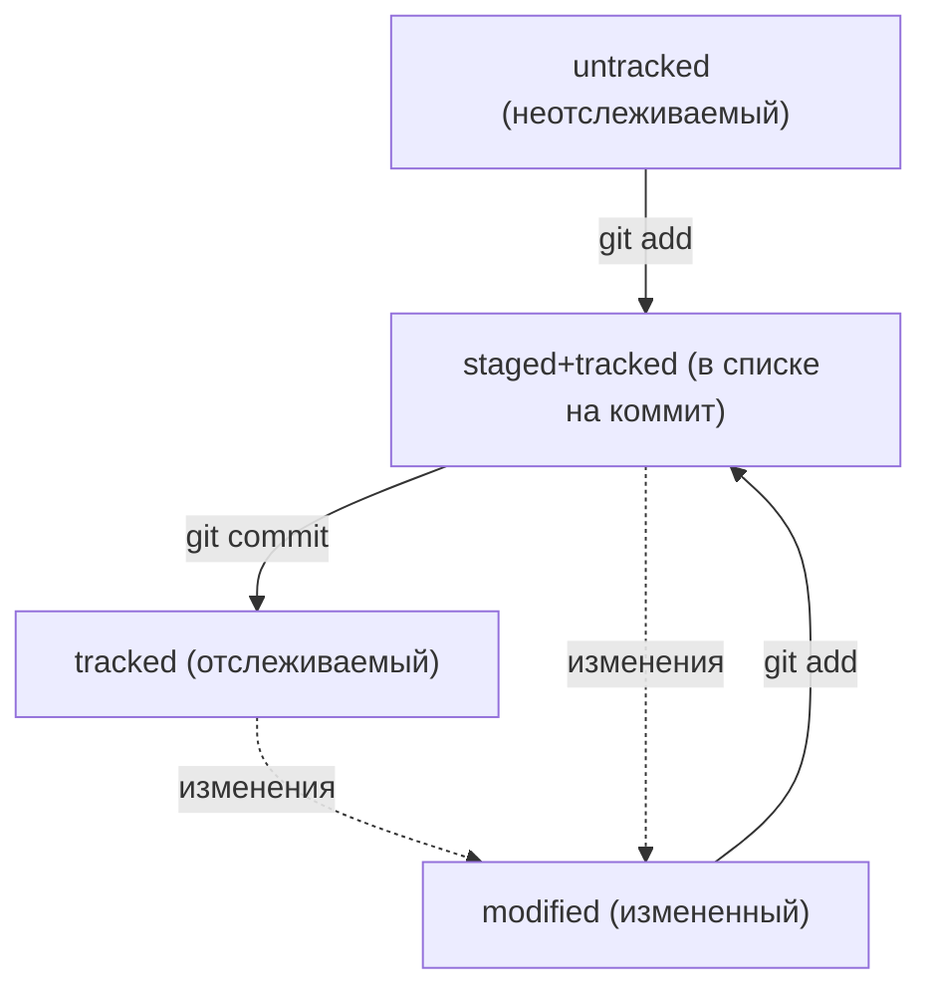

## Статусы файлов в Git  

```mermaid
flowchart TD
    A["untracked (неотслеживаемый)"]-->|git add| B[staged+tracked, в списке на коммит]
    B[staged+tracked, в списке на коммит] -->|git commit| C[tracked, отслеживаемый]
    C["tracked (отслеживаемый)"] -.-> |изменения| D[modified, измененный]
    D[modified, измененный] --> |git add| B[staged+tracked, в списке на коммит]
    B["staged+tracked (в списке на коммит)"] -.->|изменения| D["modified (измененный)"]
```
