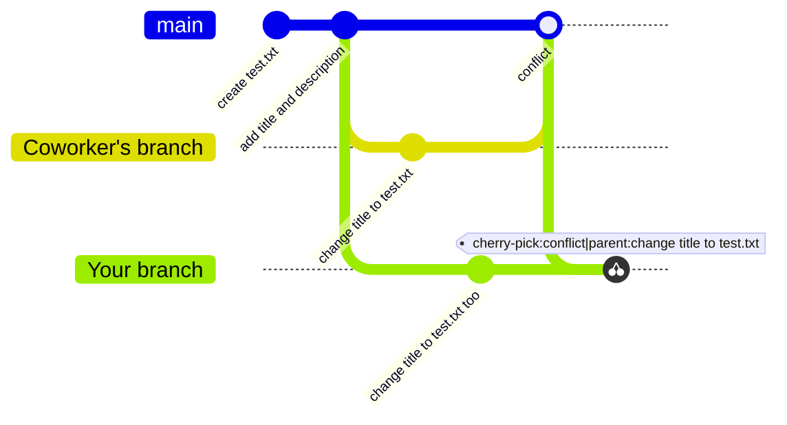

## Конфликт при слиянии веток    
Когда сразу несколько членов команды вносят изменения в один и тот же фрагмент проекта в разных ветках, при слиянии могут происходить конфликты. 

```mermaid
    gitGraph
commit id: "create test.txt"
commit id: "add title and description"
branch "Coworker's branch"
branch "Your branch"
checkout "Coworker's branch"
commit id: "change title to test.txt"
checkout "Your branch"
commit id: "change title to test.txt too"
checkout main
merge "Coworker's branch" id: "conflict"
checkout "Your branch"
cherry-pick id:"conflict" parent:"change title to test.txt"
```