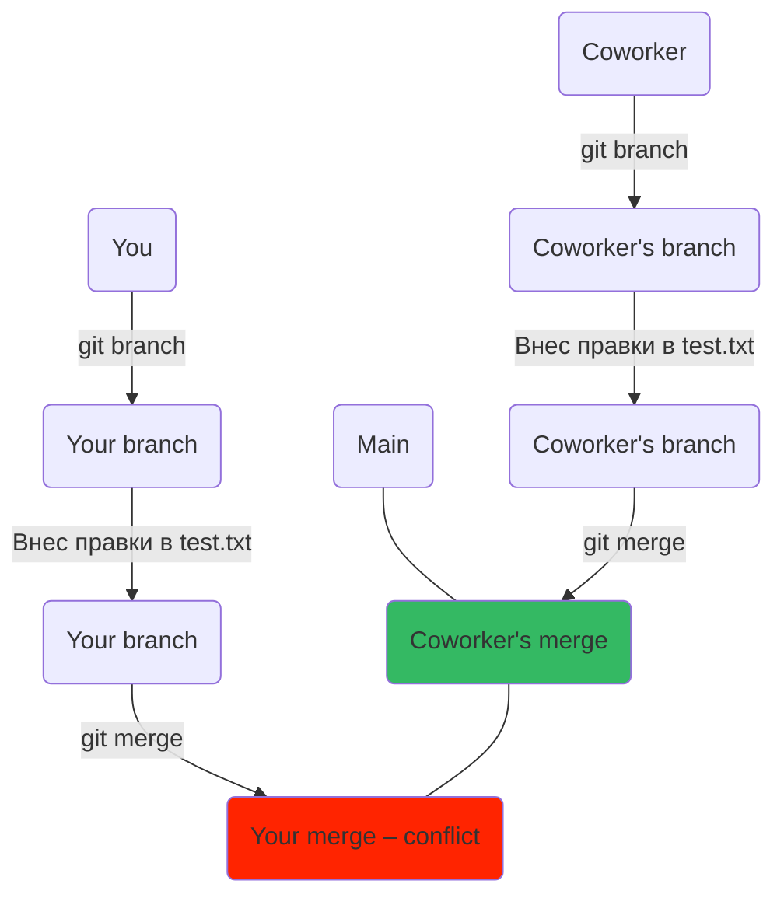
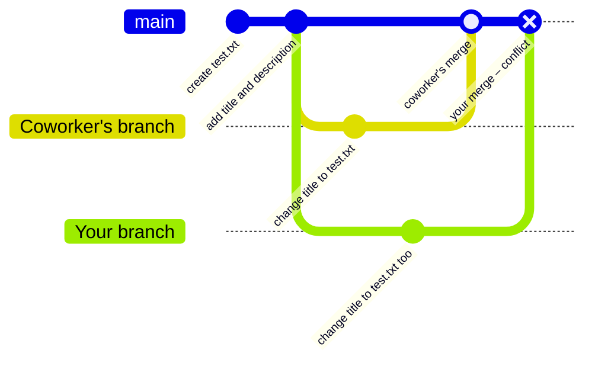

## Конфликт при слиянии веток    
Когда сразу несколько членов команды вносят изменения в один и тот же фрагмент проекта в разных ветках, при слиянии могут происходить конфликты.

Допустим, вы решили отредактировать заголовок в тексте и исправить опечатки. В этот момент ваш коллега поменял тот же самый заголовок в соседней ветке и влил изменения в main.    
После завершения работы вы делаете финальный коммит в своей ветке, переходите в основную и пытаетесь выполнить слияние. Но в терминале ошибка. На схеме эта ситуация может выглядеть так.

### git scheme
